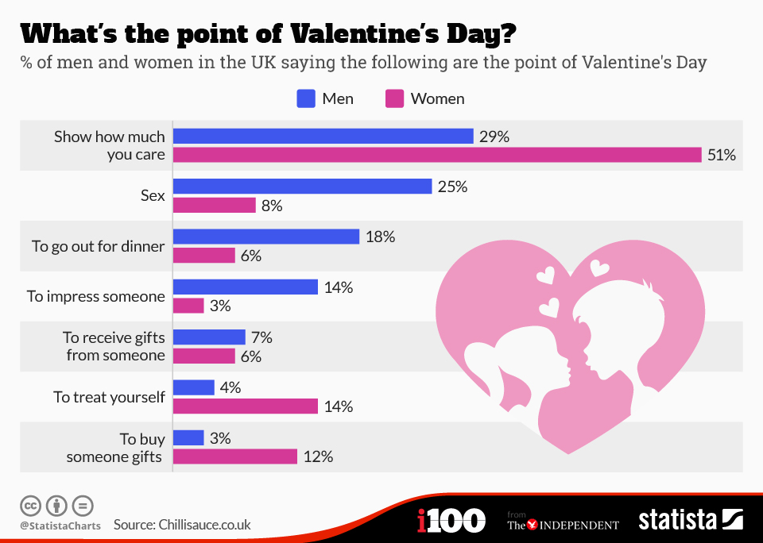
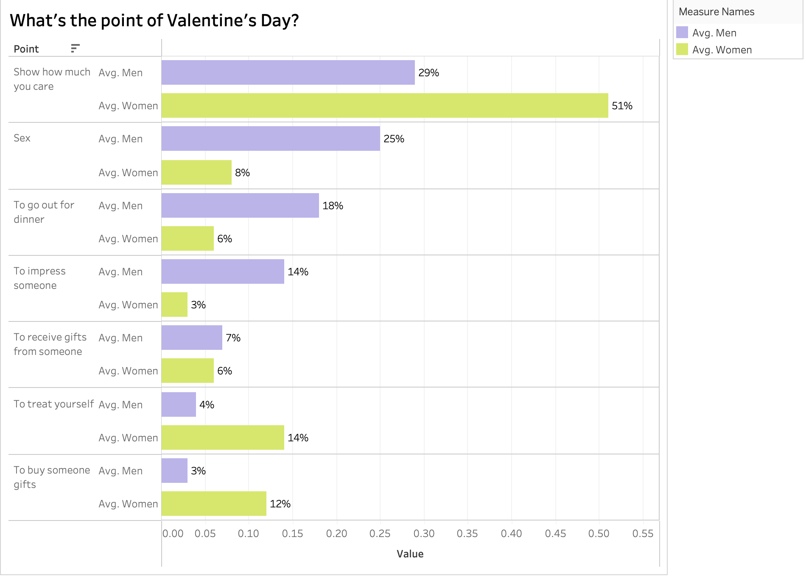

| [home page](https://cmustudent.github.io/tswd-portfolio-templates/) | [visualizing debt](visualizing-government-debt) | [critique by design](critiqueBYdesign) | [final project I](final-project-part-one) | [final project II](final-project-part-two) | [final project III](final-project-part-three) |

# Selection of Data Visualization

The data visualization selected for redesign is focused on the perceived purposes of Valentine’s Day among men and women in the UK. The original visualization, created by Chillisauce.co.uk and published via Statista 'https://www.statista.com/chart/amp/3229/whats-the-point-of-valentines-day/' , depicted the different reasons cited by men and women for celebrating Valentine’s Day, such as showing care, going out for dinner, and buying gifts.

I chose the Valentine’s Day graph because it offers an interesting and relatable exploration of how men and women perceive the purpose of the holiday, highlighting distinct gender-based differences. The data visualization is visually engaging, with clear bar charts making it easy to compare the responses of men and women across various motivations such as showing affection, receiving gifts, or treating oneself. The topic itself is culturally relevant and often discussed, providing a familiar context that can attract viewers’ attention and spark conversations.

## Part one: Critique of the Original Visualization

Upon first viewing the “What’s the point of Valentine’s Day?” visualization, I found it to be clear, engaging, and effective in comparing how men and women in the UK perceive the holiday. The bar chart format was particularly impactful, highlighting stark differences in priorities, such as women’s significantly higher emphasis on “showing how much you care” compared to men. This contrast was immediately noticeable due to the effective use of bar lengths to communicate data.

The clean, organized layout made it easy to compare categories without becoming overwhelming or confusing. However, there were some areas where the visualization could be improved. While the color scheme was functional in distinguishing between men and women, it inadvertently reinforced traditional gender stereotypes. To avoid perpetuating biases, it would be helpful to use a more neutral and inclusive color palette that maintains clarity without relying on traditional associations.

One aspect I would change is the use of extra visuals, such as the couple illustration. While visually appealing, it did not add meaningful context to the data and risked distracting viewers from the primary insights. Adding interactive elements or annotations highlighting key data points could deepen engagement and provide more value. Additionally, including a brief mention of data sources and collection methods would enhance credibility and give viewers a better understanding of the data’s context.

## Primary Audience and Effectiveness

The primary audience for this data visualization is likely the general public, with a focus on individuals interested in social trends, gender behaviors, and holiday customs, such as readers of lifestyle and behavioral habit articles. In many ways, the visualization is effective in reaching this audience. It presents key differences between men’s and women’s perspectives on Valentine’s Day in a visually engaging and easy-to-understand manner. The use of bar graphs effectively communicates differences at a glance, while the gender comparisons are clear and likely resonate with viewers.

However, there are limitations to its effectiveness. The color scheme, while distinguishing gender categories, may inadvertently reinforce traditional gender norms and could feel outdated or even alienating to more modern, inclusive viewers. Additionally, the decorative illustration of the couple, though visually appealing, detracts from the focus on data and might reduce the overall impact. More context on y-axis labels would also improve understanding, as it would clarify what the graph is illustrating without additional explanation.

## Sketching a Solution

To address the concerns identified in the original visualization, I created a wireframe solution that incorporated several key improvements. The design was simplified by removing unnecessary decorative elements that could detract from the data’s focus, making it cleaner and more visually digestible. I also considered more accessible color combinations to ensure that individuals with color vision deficiencies could easily distinguish between categories, thus enhancing the overall inclusivity and usability of the visualization. Additionally, the data categories were reordered based on descending percentages, which offered a more logical flow and made it easier for viewers to interpret the data at a glance. Contextual explanations were added to provide better audience understanding and to clarify the purpose and source of the data being presented.

## Testing the Solution

**Student 1:**
	•	What did you take away from the graph?
“It’s clear that there’s a big difference in how men and women in the UK view Valentine’s Day, with women putting a lot more emphasis on ‘showing how much you care.’”
	•	Who do you think this was made for?
“I’d guess it’s for the general public, marketers, or anyone curious about social behaviors.”
	•	Any suggestions for improvement?
“It might be helpful to add a short description for each category to clarify what they cover. Also, using a more inclusive color scheme could make it more visually accessible.”

**Student 2:**
	•	What did you understand from the graph?
“It’s comparing the reasons men and women celebrate Valentine’s Day.”
	•	How easy was it to understand?
“I got it, but I think the colors could be adjusted to be more inclusive for people who might be colorblind. Something Valentine's day themed would be pretty cool!”
	•	Who is this for?
“I think it’s aimed at people interested in social behavior trends or even marketers.”

**Student 3:**
	•	What did you get from this graph?
“It’s about why men and women celebrate Valentine’s Day, and it’s clear that showing care matters a lot more to women.”
	•	How easy was it to understand?
“Mostly clear, but I’d suggest reordering the categories based on percentage values to make it even easier.”
	•	Who is this for?
“People who want to understand social behaviors around Valentine’s Day.”
	•	Is anything missing?
“Not really”
	•	Suggestions?
“Maybe reorder the categories in a more logical way and provide more details on what ‘showing care’ really means.”

**Student 4:**
	•	What’s your takeaway?
“It highlights differences in how men and women see and celebrate Valentine’s Day.”
	•	How easy was it to understand?
“It’s pretty easy to follow, but the decorative elements feel distracting.”
	•	Who do you think would be interested in this?
“Anyone curious about relationship dynamics or social trends.”
	•	Is anything missing?
“It would be great to know if the data is for a specific age group or demographic.”
	•	Changes you’d make?
“I’d remove the decorative image to keep it focused on the data and maybe add a brief takeaway or key insight.”

The feedback showed that the visualization did a good job of highlighting how men and women in the UK view Valentine’s Day differently, with women putting a stronger emphasis on “showing how much you care.” Most people thought it would be interesting to anyone curious about social trends or marketing insights. Suggestions included adding more context to each category, reordering the data for better clarity, and making the color scheme more inclusive for those with colorblindness. While many found it easy to understand, some felt the decorative elements were distracting and suggested simplifying the design to keep the focus on the data itself.

## Revised Version

Based on the feedback I received from the students, I made several improvements to the Valentine’s Day visualization:
	•	Updated the title for clarity and added some context to it, ensuring it accurately reflects the data being shown.
	•	Added a legend to clearly differentiate between men’s and women’s responses, improving accessibility for viewers.
	•	Adjusted the color scheme to be more inclusive and considerate, making it easier for a broader audience to engage with.
	•	Removed decorative elements that were distracting, such as the heart image, to maintain focus on the data itself.
	•	Reordered the categories based on percentage values, making it easier to follow and highlighting key insights at a glance.

  <noscript>
    
  </noscript>
  <object class='tableauViz'  style='display:none;'>
    <param name='host_url' value='https%3A%2F%2Fpublic.tableau.com%2F' />
    <param name='embed_code_version' value='3' />
    <param name='site_root' value='' />
    <param name='name' value='vday_17315484584430&#47;Sheet12' />
    <param name='tabs' value='no' />
    <param name='toolbar' value='yes' />
    <param name='static_image' value='https:&#47;&#47;public.tableau.com&#47;static&#47;images&#47;vd&#47;vday_17315484584430&#47;Sheet12&#47;1.png' />
    <param name='animate_transition' value='yes' />
    <param name='display_static_image' value='yes' />
    <param name='display_spinner' value='yes' />
    <param name='display_overlay' value='yes' />
    <param name='display_count' value='yes' />
    <param name='language' value='en-US' />
    <param name='filter' value='publish=yes' />
  </object>

