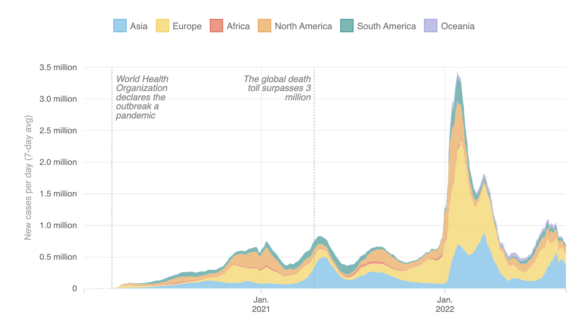
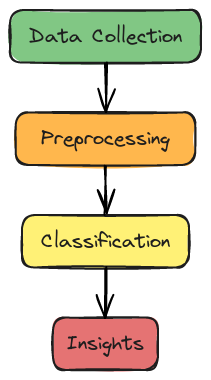
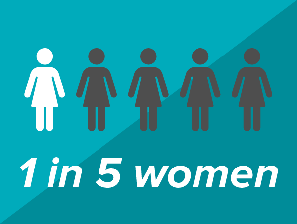

| [home page](https://herleapoorva.github.io/apoorvaherle-portfolio/) | [visualizing debt](https://herleapoorva.github.io/apoorvaherle-portfolio/visualizing-government-debt) | [critique by design](https://herleapoorva.github.io/apoorvaherle-portfolio/critiqueBYdesign) | [final project I](https://herleapoorva.github.io/apoorvaherle-portfolio/final-project-ApoorvaHerle) | [final project II](final-project-part-two) | [final project III](final-project-part-three) |

# Outline
For my final project, I’m working on a machine-learning approach to classify tweets about Gender-Based Violence (GBV) into five categories: sexual violence, emotional violence, harmful traditional practices, physical violence, and economic violence. The idea is to shed light on the different forms of GBV and provide a clearer picture of what people are experiencing and sharing online. Many victims find it difficult to speak out due to fear, shame, or social pressure, so analyzing tweets can help amplify their voices and offer data-driven insights for policymakers and support systems.

The project’s story arc starts with an overview of the widespread issue of GBV, especially during times of crisis like the COVID-19 pandemic. I’ll then highlight the challenges victims face, including the fear of speaking out and limited knowledge of support options. The main part focuses on using social media data to classify and better understand these experiences while being mindful of the sensitivity of the content. The project wraps up by exploring how these insights can drive real change and support gender equality, influencing policy and resources for those in need.

# Structure

1. Introduction:  Imagine a world where millions of voices go unheard, where people suffer in silence because of fear, stigma, or simply not knowing where to turn. That’s the world of Gender-Based Violence (GBV). During the COVID-19 pandemic, this silent epidemic became even louder, yet somehow more invisible. In this project, I want to shine a light on these stories. Using the power of social media and data, I hope to uncover the experiences people are sharing online and bring them to the forefront.

2. The Challenges People Face: It’s not easy for victims of GBV to speak up. The fear of judgment or retaliation can be overwhelming. Even when they do, finding help can feel impossible. Traditional ways of collecting data—like surveys or reports—don’t always capture the whole picture. But social media gives us a different window, one where people can share their truths more freely. My goal is to treat these stories with the care they deserve, while navigating the ethical challenges of working with sensitive content.

3. Insights That Tell a Story: The most powerful part of this project will be the stories the data tells. What types of violence are being talked about the most? Are there hotspots where GBV seems more prevalent? Do we see spikes during certain events or times of the year? Through visuals like maps and charts, I plan to share these insights in a way that’s clear and relatable. Because behind every tweet is a real person, with a real story.

4. Wrapping Up with Hope: At the end of the day, this project isn’t just about machine learning or tweets. It’s about people—about listening to their voices and doing something meaningful with what we hear. Technology gives us a way to amplify those voices and turn them into real change. My hope is that this project inspires others to join the fight for gender equality and reminds us all of the power of empathy combined with action.

# Initial sketches 

A timeline or infographic showing the rise of GBV cases during specific events like the COVID-19 pandemic. 

Source: https://images.app.goo.gl/6NtjPTD6tRseUp4J6

Machine Learning Approach: My data pipeline

Dicussing report 

Source : https://images.app.goo.gl/QdGzZZEcmjwEQF2n7

Hope for justice 

Source : https://images.app.goo.gl/9kYjF8bWgyx66CPV7

# Data Sources

Primary Data Source

For this project, I am using the publicly accessible dataset titled Gender-Based Violence Tweet Classification from Kaggle - https://www.kaggle.com/datasets/gauravduttakiit/gender-based-violence-tweet-classification/data . This dataset contains tweets related to various forms of Gender-Based Violence (GBV), which can be classified into distinct categories. It includes textual data from social media posts, providing an invaluable resource for understanding online conversations about GBV.

This dataset offers a solid foundation for building a machine learning model, as it is pre-annotated into categories, simplifying the supervised learning process. It also allows me to explore key trends in GBV-related discussions, including their prevalence and the different forms of violence that are most commonly talked about online.

# How I Plan to Use the Data

  1.	Data Exploration and Cleaning:
I’ll start by exploring the dataset to understand the distribution of tweets and their categories. 
	2.	Model Training:
Using the cleaned data, I’ll train a supervised learning model to classify the data into the predefined GBV categories.
	3.	Insights Generation:
I’ll analyze the classified tweets to uncover patterns, such as the most discussed types of GBV, geographic trends, and activity spikes during specific events or crises.
	4.	Visualization:
To communicate my findings, I’ll create visualizations using tools like Tableau and Python libraries.

# Method and Medium

I plan to use Shorthand to create an engaging narrative for my project, incorporating text, visuals, and multimedia to guide the audience through the story. For data visualizations, I plan to use Tableau to design interactive visuals like pie charts, heatmaps, and line graphs that effectively communicate insights.

The final deliverable will be an interactive, digital presentation hosted online. I also plan to document all materials, including visualizations, processed data, and source code, on a GitHub repository to ensure accessibility and reproducibility.

