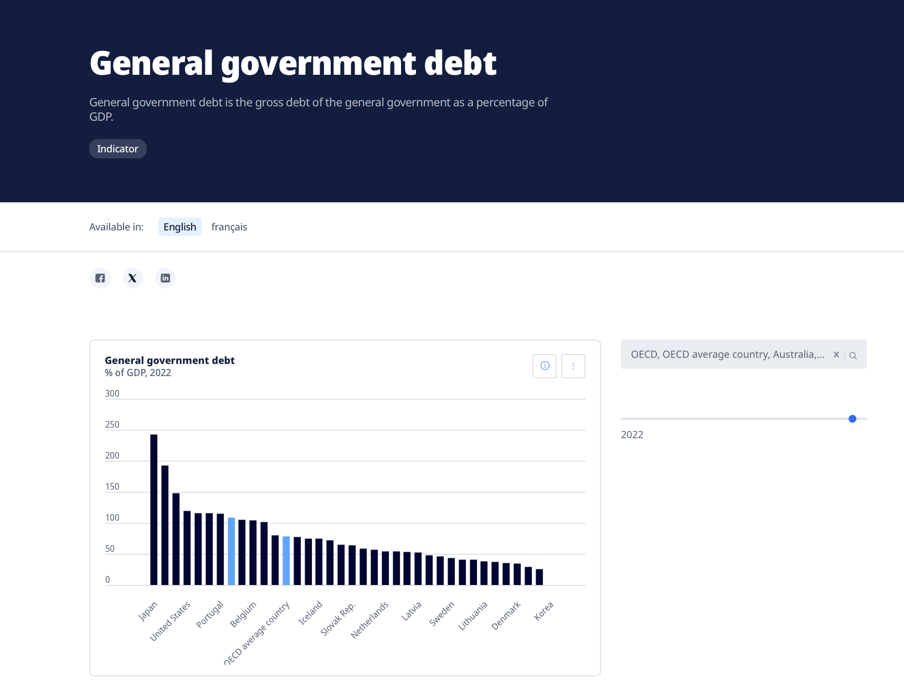

| [home page](https://cmustudent.github.io/tswd-portfolio-templates/) | [visualizing debt](visualizing-government-debt) | [critique by design](critique-by-design) | [final project I](final-project-part-one) | [final project II](final-project-part-two) | [final project III](final-project-part-three) |

# General Government Debt
Visualizing-government-debt

In this project, we examine government debt as a percentage of GDP across various nations, using data sourced from the OECD . Our objective is to depict the fiscal landscape and the impact of policies in different countries through diverse visualizations

Further data analysis and visualization were conducted using Tableau, showcasing our proficiency with advanced visualization tools. This practical application has enhanced our ability to convey complex economic narratives effectively, an essential competency in the field of data science and economics.

Part one: Working with web-based visualization tools and data

This bar chart illustrates the general government debt as a percentage of GDP for selected countries in the year 2022. Data is sourced from the Organization for Economic Co-operation and Development (OECD), providing a credible snapshot of fiscal health across these nations. This visualization not only sheds light on the current fiscal positions but also raises questions about the economic strategies that lead to such varied debt levels, stimulating further research and discussion.

## Part one: Working with web-based visualization tools and data

    <noscript>
        
    </noscript>
    <object class='tableauViz' style='display:none;'>
        <param name='host_url' value='https%3A%2F%2Fpublic.tableau.com%2F' />
        <param name='embed_code_version' value='3' />
        <param name='site_root' value='' />
        <param name='name' value='TableauHW1_17305842575400/Sheet1' />
        <param name='tabs' value='no' />
        <param name='toolbar' value='yes' />
        <param name='static_image' value='https://public.tableau.com/static/images/Ta/TableauHW1_17305842575400/Sheet1/1.png' />
        <param name='animate_transition' value='yes' />
        <param name='display_static_image' value='yes' />
        <param name='display_spinner' value='yes' />
        <param name='display_overlay' value='yes' />
        <param name='display_count' value='yes' />
        <param name='language' value='en-US' />
        <param name='filter' value='publish=yes' />
    </object>

## Working with Tableau

## Part three: create your own visualization

Part three: create your own visualization

    <noscript>
        
    </noscript>
    <object class='tableauViz'  style='display:none;'>
        <param name='host_url' value='https%3A%2F%2Fpublic.tableau.com%2F' /> 
        <param name='embed_code_version' value='3' /> 
        <param name='site_root' value='' />
        <param name='name' value='TableauHW2_17306772971950&#47;Sheet1' />
        <param name='tabs' value='no' /><param name='toolbar' value='yes' />
        <param name='static_image' value='https:&#47;&#47;public.tableau.com&#47;static&#47;images&#47;Ta&#47;TableauHW2_17306772971950&#47;Sheet1&#47;1.png' /> 
        <param name='animate_transition' value='yes' />
        <param name='display_static_image' value='yes' />
        <param name='display_spinner' value='yes' />
        <param name='display_overlay' value='yes' />
        <param name='display_count' value='yes' />
        <param name='language' value='en-US' />
        <param name='filter' value='publish=yes' />
    </object>

 

